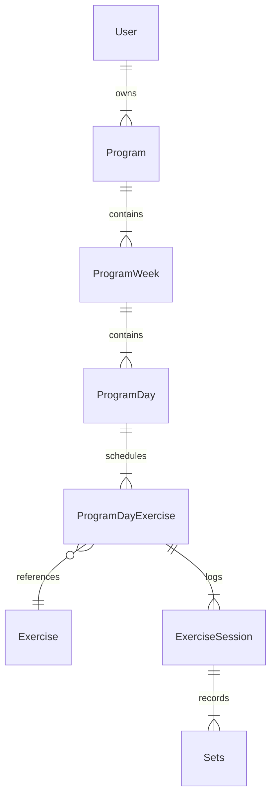

# Gym Tracker - System design document

## 1. Problem statement

---

Gym goers tend to go to the gym, wing their workout and leave. This is okay for some, but for those who wish to see real
progress over time, it is important they track their workouts. This allows them to keep themselves motivated and 
achieve their fitness goals.

Some, though, find it a hassle to keep track of their workouts. As some people feel they need to bring a book and pen to 
the gym or use Excel sheets to track their workouts. These are okay options, though they both lack something important.
That is feedback. Feedback in the form of gym progress allows the user to fully understand their progress and helps
them make informed decisions. Without necessary information, users could waste weeks and countless sessions in an idle 
state with little to no progress. This is what we want to avoid.

Gym Tracker is an application that allows users to record their gym workouts in a simple and intuitive way. Using the
data entered by the user, it will be able to generate feedback that will help the user in their fitness journey.

## 2. User stories

---

As a user, I want to create a profile so that I can access
my personal workout data securely.

As a user, I want to log in and out of my account so that
my data remains private and secure.

As a user, I want to create a program so that I have a
structured plan to follow in the gym.

As a user, I want to edit a program so that I can adjust
my training plan if my goals change.

As a user, I want to delete a program so that I can remove
plans I no longer need.

As a user, I want to select and activate a program so that
the app knows which plan I am currently following.

As a user, I want to log my current days workout so that
my progress is recorded.

As a user, I want to view previous weeks workouts for
reference whilst logging.

As a user, I want to view past programs and their statistics
so that I can reflect on my fitness journey.

As a user, I want to add custom exercises to the exercise
list so that my programs reflect my personal training style.

As a user, I want to edit and delete my profile so that
my account information stays accurate.


## 3. Domain model

---

### 3.1 Entity structure

- User – A registered account holder who owns programs
  and logs workouts.
- Exercise – A reusable reference exercise that can be
  used across many programs.
- Program – A structured workout plan created by a user,
  consisting of multiple weeks.
- ProgramWeek – A single week within a program, containing
  the days and exercises planned for that week.
- ProgramDay – A single training day within a week,
  associated with a specific muscle group.
- ProgramDayExercise – The planned exercise for a specific
  day, including the target sets and reps.
- ExerciseSession – The logged reality of performing an
  exercise on a specific day, linking the plan to the
  actual performance.
- Set – A single recorded set containing the actual weight
  and reps performed by the user.

### 3.2 Entity relationships

- User → Program (one-to-many)
- Program → ProgramWeek (one-to-many)
- ProgramWeek → ProgramDay (one-to-many)
- ProgramDay → ProgramDayExercise(one to many)
- ProgramDayExercise → ExerciseSession(one-to-many)
- ExerciseSession → Sets(one-to-many)
- ProgramDayExercise → Exercise(many-to-one)


### 3.3 Entity relationship diagram



### 3.3 Entity Attributes

- User:
  - id
  - firstName
  - lastName
  - email
  - password
  - phoneNumber
  - role
  - createdAt
  - updatedAt
- Program:
  - id
  - name
  - programLength
  - userId
  - status
  - createdAt
  - updatedAt
- ProgramWeek:
  - id
  - weekNumber
  - programId
  - startedAt
  - completedAt
  - createdAt
- ProgramDay:
  - id
  - dayNumber
  - muscleGroup
  - programWeekId
  - isCompleted
  - createdAt
- ProgramDayExercise:
  - id
  - exerciseOrder
  - exerciseId
  - targetReps
  - targetSets
  - programDayId
  - createdAt
  - updatedAt
- ExerciseSession:
  - id 
  - notes
  - ProgramDayExerciseId
  - performedAt
  - createdAt
  - updatedAt
- Set:
  - id
  - setOrder
  - weightDone
  - achievedReps
  - exerciseSessionId
  - createdAt
  - updatedAt
- Exercise:
  - id 
  - name
  - muscleGroup
  - createdAt

### 3.4 API Design

#### User

- PATCH /users → Update a user
- DELETE /users → Delete user

### Program

- GET /programs/{id} → Get Program by id
- GET /programs → Get all programs
- GET /programs?status={status} → Get past programs
- POST /programs → Create a new Program 

**Request Body:**
```json
{
  "name": "Push Pull Legs",
  "weeks": [
    {
      "weekNumber": 1,
      "days": [
        {
          "muscleGroup": "Chest",
          "programDayExercises": [
            {
              "exerciseId": 1,
              "exerciseNumber": 1,
              "targetSets": 4,
              "targetReps": 8
            }
          ]
        }
      ]
    }
  ]
}
```
**Response:** `201 Created` → on success
**Error Responses:**
- `404 Not Found` → program does not exist
- `409 Conflict` → no active program
- `403 Forbidden` → unauthorised
---

- PATCH /programs/{id} → Update existing program
- PATCH /programs/{id}/activate → Activate a program as the current program
- DELETE /programs/{id} → Delete a program

### ProgramWeek

- GET /program-weeks/{id} → Get Program week by id
- PATCH /programs-weeks/{id} → Log Program week data

### ProgramDay

- PATCH /program-days/{programId} → Change state of Program day

### ProgramDayExercise

- GET /program-day-exercises/{id} → Get Program day exercise information by id
- PATCH /program-day-exercise/{id} → Update an exercise for ProgramDayExercise

### Exercise

- GET /exercises/muscle-group → Get exercises by muscle group
- POST /exercises → Add a new exercise


### ExerciseSession

- GET /exercises-session/{id} → Get Exercise session by Id
- POST /exercises-session → Log Exercise session data


### Authentication

- POST /login → Log into application
- POST /register → Register a new user


