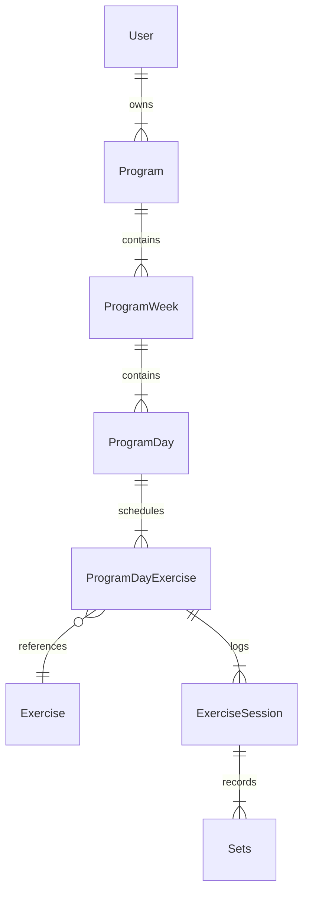

# Gym Tracker - System design document

## 1. Problem statement

---

Gym goers tend to go to the gym, wing their workout and leave. This is okay for some, but for those who wish to see real
progress over time, it is important they track their workouts. This allows them to keep themselves motivated and 
achieve their fitness goals.

Some, though, find it a hassle to keep track of their workouts. As some people feel they need to bring a book and pen to 
the gym or use Excel sheets to track their workouts. These are okay options, though they both lack something important.
That is feedback. Feedback in the form of gym progress allows the user to fully understand their progress and helps
them make informed decisions. Without necessary information, users could waste weeks and countless sessions in an idle 
state with little to no progress. This is what we want to avoid.

Gym Tracker is an application that allows users to record their gym workouts in a simple and intuitive way. Using the
data entered by the user, it will be able to generate feedback that will help the user in their fitness journey.

## 2. User stories

---

As a user, I want to create a profile so that I can access
my personal workout data securely.

As a user, I want to log in and out of my account so that
my data remains private and secure.

As a user, I want to create a program so that I have a
structured plan to follow in the gym.

As a user, I want to edit a program so that I can adjust
my training plan if my goals change.

As a user, I want to delete a program so that I can remove
plans I no longer need.

As a user, I want to select and activate a program so that
the app knows which plan I am currently following.

As a user, I want to log my current days workout so that
my progress is recorded.

As a user, I want to view previous weeks workouts for
reference whilst logging.

As a user, I want to view past programs and their statistics
so that I can reflect on my fitness journey.

As a user, I want to add custom exercises to the exercise
list so that my programs reflect my personal training style.

As a user, I want to edit and delete my profile so that
my account information stays accurate.


## 3. Domain model

---

### 3.1 Entity structure

- User – A registered account holder who owns programs
  and logs workouts.
- Exercise – A reusable reference exercise that can be
  used across many programs.
- Program – A structured workout plan created by a user,
  consisting of multiple weeks.
- ProgramWeek – A single week within a program, containing
  the days and exercises planned for that week.
- ProgramDay – A single training day within a week,
  associated with a specific muscle group.
- ProgramDayExercise – The planned exercise for a specific
  day, including the target sets and reps.
- ExerciseSession – The logged reality of performing an
  exercise on a specific day, linking the plan to the
  actual performance.
- Set – A single recorded set containing the actual weight
  and reps performed by the user.

### 3.2 Entity relationships

- User → Program (one-to-many)
- Program → ProgramWeek (one-to-many)
- ProgramWeek → ProgramDay (one-to-many)
- ProgramDay → ProgramDayExercise(one to many)
- ProgramDayExercise → ExerciseSession(one-to-many)
- ExerciseSession → Sets(one-to-many)
- ProgramDayExercise → Exercise(many-to-one)


### 3.3 Entity relationship diagram



### 3.3 Entity Attributes

- User:
  - id
  - firstName
  - lastName
  - email
  - password
  - phoneNumber
  - role
  - createdAt
  - updatedAt
- Program:
  - id
  - name
  - programLength
  - userId
  - status
  - createdAt
  - updatedAt
- ProgramWeek:
  - id
  - weekNumber
  - programId
  - startedAt
  - completedAt
  - createdAt
- ProgramDay:
  - id
  - dayOrder
  - muscleGroup
  - programWeekId
  - isCompleted
  - createdAt
- ProgramDayExercise:
  - id
  - exerciseOrder
  - exerciseId
  - targetReps
  - targetSets
  - programDayId
  - createdAt
  - updatedAt
- ExerciseSession:
  - id 
  - notes
  - ProgramDayExerciseId
  - performedAt
  - createdAt
  - updatedAt
- Set:
  - id
  - setOrder
  - weightDone
  - achievedReps
  - exerciseSessionId
  - createdAt
  - updatedAt
- Exercise:
  - id 
  - name
  - muscleGroup
  - createdAt

### 3.4. API Design

### Error Response Format

All errors return the following structure:

```json
{
  "status": 404,
  "error": "NOT_FOUND",
  "message": "Program with id 1 was not found",
  "timestamp": "2026-01-01T10:15:30"
}
```

---

### Authentication

#### POST /auth/register
Registers a new user account.

**Request Body:**
```json
{
  "firstName": "John",
  "lastName": "Doe",
  "email": "john@example.com",
  "password": "securepassword123",
  "phoneNumber": "0712345678"
}
```

**Response:** `200 OK`
```json
{ "token": "eyJhbGci..." }
```

**Error Responses:**
- `400 Bad Request` → validation failed
- `400 Bad Request` → user with email already exists

---

#### POST /auth/login
Authenticates a user and returns a JWT token.

**Request Body:**
```json
{
  "email": "john@example.com",
  "password": "securepassword123"
}
```

**Response:** `200 OK`
```json
{ "token": "eyJhbGci..." }
```

**Error Responses:**
- `401 Unauthorized` → invalid email or password

---

### User

#### PATCH /users
Updates the authenticated user's profile details.

**Request Body:**
```json
{
  "firstName": "John",
  "lastName": "Doe"
}
```

**Response:** `200 OK`
```json
{
  "firstName": "John",
  "lastName": "Doe"
}
```

**Error Responses:**
- `404 Not Found` → user not found

---

#### DELETE /users
Deletes the authenticated user's account.

**Response:** `204 No Content`

**Error Responses:**
- `404 Not Found` → user not found

---

### Program

#### GET /programs
Returns all programs for the authenticated user. Supports optional status filter.

**Query Parameters:**
- `status` (optional) → `ACTIVE`, `INACTIVE`, `COMPLETED`

**Example:** `GET /programs?status=COMPLETED`

**Response:** `200 OK`
```json
{
  "programs": [
    {
      "id": 1,
      "name": "Push Pull Legs",
      "programLength": 6,
      "status": "ACTIVE"
    }
  ]
}
```

---

#### GET /programs/{id}
Returns a single program with its full week and day structure.

**Response:** `200 OK`
```json
{
  "id": 1,
  "name": "Push Pull Legs",
  "programLength": 6,
  "status": "ACTIVE",
  "programWeeks": [
    {
      "id": 1,
      "weekNumber": 1,
      "programDays": [
        {
          "id": 1,
          "muscleGroup": "Chest",
          "isCompleted": false,
          "programDayExercises": [
            {
              "id": 1,
              "exerciseName": "Bench Press",
              "exerciseOrder": 1,
              "targetSets": 4,
              "targetReps": 8
            }
          ]
        }
      ]
    }
  ]
}
```

**Error Responses:**
- `404 Not Found` → program not found

---

#### POST /programs
Creates a new program with its complete week, day and exercise structure.

**Request Body:**
```json
{
  "name": "Push Pull Legs",
  "numberOfWeeks": 6,
  "programWeeks": [
    {
      "weekNumber": 1,
      "programDays": [
        {
          "muscleGroup": "Chest",
          "programDayExercises": [
            {
              "exerciseId": 1,
              "exerciseOrder": 1,
              "targetSets": 4,
              "targetReps": 8
            }
          ]
        }
      ]
    }
  ]
}
```

**Response:** `201 Created`
```json
{
  "id": 1,
  "name": "Push Pull Legs",
  "status": "INACTIVE"
}
```

**Error Responses:**
- `400 Bad Request` → validation failed
- `404 Not Found` → exercise not found

---

#### PATCH /programs/{id}
Updates an existing program's details.

**Request Body:**
```json
{
  "name": "Updated Program Name"
}
```

**Response:** `200 OK`
```json
{
  "id": 1,
  "name": "Updated Program Name",
  "status": "INACTIVE"
}
```

**Error Responses:**
- `404 Not Found` → program not found

---

#### PATCH /programs/{id}/activate
Sets a program as the user's active program. Any previously active program is set to `INACTIVE`.

**Response:** `200 OK`
```json
{
  "id": 1,
  "name": "Push Pull Legs",
  "status": "ACTIVE"
}
```

**Error Responses:**
- `404 Not Found` → program not found

---

#### DELETE /programs/{id}
Deletes a program and all associated data.

**Response:** `204 No Content`

**Error Responses:**
- `404 Not Found` → program not found

---

### Program Week

#### GET /program-weeks/{id}
Returns a single program week with its days and exercises.

**Response:** `200 OK`
```json
{
  "id": 1,
  "weekNumber": 1,
  "startedAt": "2026-01-06T09:00:00",
  "completedAt": null,
  "programDays": [
    {
      "id": 1,
      "muscleGroup": "Chest",
      "isCompleted": false,
      "programDayExercises": [...]
    }
  ]
}
```

**Error Responses:**
- `404 Not Found` → program week not found

---

### Program Day

#### PATCH /program-days/{id}/complete
Marks a program day as completed.

**Response:** `200 OK`
```json
{
  "id": 1,
  "muscleGroup": "Chest",
  "isCompleted": true
}
```

**Error Responses:**
- `404 Not Found` → program day not found
- `409 Conflict` → no active program

---

### Program Day Exercise

#### GET /program-day-exercises/{id}
Returns a single program day exercise with its planned details.

**Response:** `200 OK`
```json
{
  "id": 1,
  "exerciseName": "Bench Press",
  "exerciseOrder": 1,
  "targetSets": 4,
  "targetReps": 8
}
```

**Error Responses:**
- `404 Not Found` → program day exercise not found

---

#### PATCH /program-day-exercises/{id}
Updates the planned sets or reps for an exercise.

**Request Body:**
```json
{
  "targetSets": 3,
  "targetReps": 10
}
```

**Response:** `200 OK`
```json
{
  "id": 1,
  "exerciseName": "Bench Press",
  "exerciseOrder": 1,
  "targetSets": 3,
  "targetReps": 10
}
```

**Error Responses:**
- `404 Not Found` → program day exercise not found

---

### Exercise

#### GET /exercises
Returns all exercises optionally filtered by muscle group.

**Query Parameters:**
- `muscleGroup` (optional) → e.g. `CHEST`, `BACK`, `BICEPS`

**Example:** `GET /exercises?muscleGroup=CHEST`

**Response:** `200 OK`
```json
{
  "exercises": [
    {
      "id": 1,
      "name": "Bench Press",
      "muscleGroup": "CHEST"
    }
  ]
}
```

---

#### POST /exercises
Adds a new exercise to the exercise list.

**Request Body:**
```json
{
  "name": "Incline Bench Press",
  "muscleGroup": "CHEST"
}
```

**Response:** `201 Created`
```json
{
  "id": 2,
  "name": "Incline Bench Press",
  "muscleGroup": "CHEST"
}
```

**Error Responses:**
- `409 Conflict` → exercise already exists
- `400 Bad Request` → validation failed

---

### Exercise Session

#### GET /exercise-sessions/{id}
Returns a single exercise session with its logged sets.

**Response:** `200 OK`
```json
{
  "id": 1,
  "notes": "Felt strong today",
  "performedAt": "2026-01-06T10:30:00",
  "sets": [
    {
      "id": 1,
      "setOrder": 1,
      "achievedReps": 8,
      "weightDone": 80
    }
  ]
}
```

**Error Responses:**
- `404 Not Found` → exercise session not found

---

#### POST /exercise-sessions
Logs a completed exercise session with its sets for the current active program.

**Request Body:**
```json
{
  "programDayExerciseId": 1,
  "notes": "Felt strong today",
  "sets": [
    {
      "setOrder": 1,
      "achievedReps": 8,
      "weightDone": 80
    },
    {
      "setOrder": 2,
      "achievedReps": 7,
      "weightDone": 82
    }
  ]
}
```

**Response:** `201 Created`
```json
{
  "id": 1,
  "notes": "Felt strong today",
  "performedAt": "2026-01-06T10:30:00",
  "sets": [
    {
      "id": 1,
      "setOrder": 1,
      "achievedReps": 8,
      "weightDone": 80
    }
  ]
}
```

**Error Responses:**
- `404 Not Found` → program day exercise not found or belongs to another user
- `409 Conflict` → no active program
- `400 Bad Request` → validation failed


## 4. Business rules

---


### Program

- A user can have multiple programs.
- Only one program can be active at a time
- Creating a new program automatically sets it as inactive.
- A program can be deleted only if it is not active.
- A program can be marked as completed only if it is active.
- A program can be marked as active only if it is not completed.
- A completed program's template can be copied for new programs.
- A program can be edited if active
- If a user actives a program, the current program is set to inactive - state transition with confirmation

### Exercises

- Custom exercises can be added to the exercise list.
- An exercise can be deleted only if it is not used in any program.
- No duplicate exercises can be added.

### User 

- User can edit profile
- User can delete an account
- Users can't share login credentials such as the same email
- User loses all data when an account is deleted
- Users can only edit their own profile

### Progress

- A program week can only be marked complete when all
  program days within it are completed. Users cannot
  advance to the next week until the current week is
  fully logged.
- Program day can only be marked complete when all program day exercises are logged
- Program is only completed when all program weeks are marked complete
- Session is only valid when all data is entered
- Program days are sequential, not calendar-bound.
  The next incomplete day in the current week is always
  presented to the user regardless of the actual day of
  the week.

### Workout Logging

- Can only log data to an active program
- Data can only be edited 24 hours after logged
- Only one workout can be logged per day
- All data is required to log a workout

## 6. Spring AI — Future Scope

---

Planned integration of Spring AI to provide intelligent
feedback to users based on their workout data.

Potential use cases:
- Suggesting when to increase weight based on progressive
  overload patterns
- Generating personalised program recommendations
- Summarising a user's progress in natural language